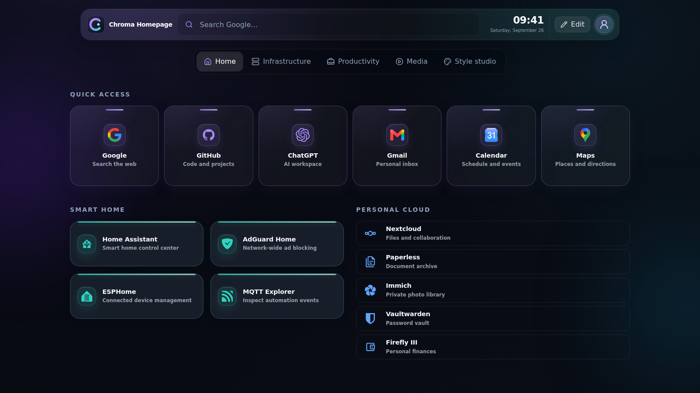
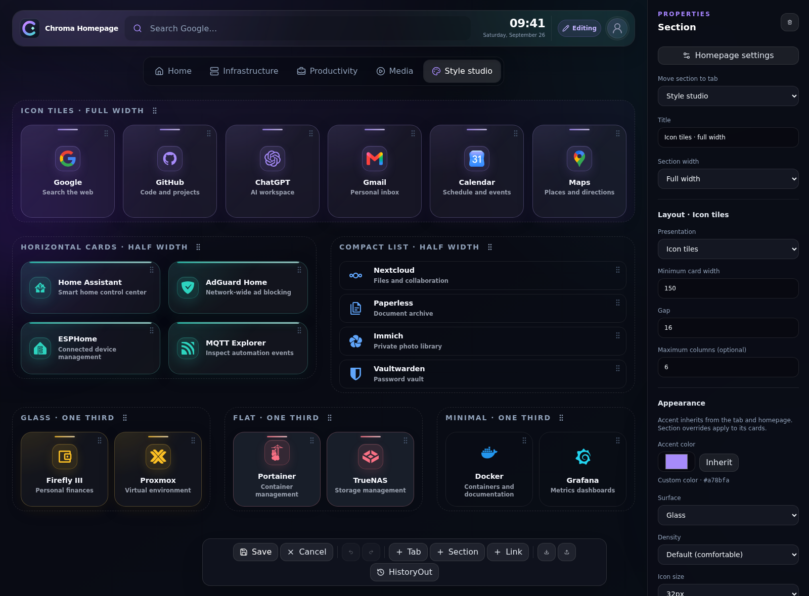

<p align="center">
  
</p>

<h1 align="center">Chroma Homepage</h1>

<p align="center"><strong>Your home on the web. Designed by you.</strong></p>

<p align="center">
  A self-hosted start page with a complete visual editor.<br>
  Organize your services, everyday links, and favorite tools—without editing YAML.
</p>

<p align="center">
  <a href="#quick-start">Quick start</a> ·
  <a href="docs/user-guide.md">User guide</a> ·
  <a href="docs/architecture.md">Architecture</a> ·
  <a href="docs/improvements.md">Roadmap</a> ·
  <a href="#buy-me-a-coffee">Support</a>
</p>



## A homepage, not a configuration project

Chroma stays clean when you are browsing and becomes a visual workspace when you
open **Profile avatar → Homepage settings**. Arrange tabs, move entire sections, choose card layouts, and tune
colors in the Inspector. Nothing is persisted until you **Save**.

| Make it yours | Keep it simple |
| --- | --- |
| **Visual editing** — draft changes, Undo/Redo, Save and Cancel | **Self-hosted** — one container, one persistent data directory |
| **Flexible layouts** — horizontal cards, icon tiles, compact lists, bento boxes | **Portable JSON** — readable, versioned documents; no database |
| **Drag across tabs** — move cards or whole sections | **Independent profiles** — separate homepages on the same server |
| **Inherited styling** — homepage → tab → section → card | **Safe editing workflow** — validation, atomic writes, previous-version backups |
| **Icons and images** — Iconify search, uploads, accent extraction | **Fast access** — type-to-search launcher, aliases, tags, web shortcuts |
| **Live cards** — API-backed widgets with server-side caching | **Protected credentials** — encrypted at rest and excluded from config exports |



*Screenshots use demo links only. The Style studio is an optional showcase generated
by the included script; no personal dashboard or browsing history is pictured.*

## Quick start

With Docker and Docker Compose installed:

```bash
git clone https://github.com/jincenzo/chroma-homepage.git
cd chroma-homepage
docker compose up -d --build
```

Open **http://localhost:3000**. Demo links are ready to explore; open **Profile avatar → Homepage settings** to
make them yours.

Want a different port?

```bash
PORT=8080 docker compose up -d --build
```

The `chroma-data` volume persists your configuration, profiles, images, and backups
under `/data`. Back up the whole directory to keep everything portable.
`docker compose down` preserves it; **`docker compose down -v` deletes the volume**.

> **Trusted networks only:** this version has no authentication. Anyone who can
> reach the server can read and change every profile. Do not expose it directly
> to the public internet. See [Security & privacy](SECURITY.md).

## Find your flow

### Arrange visually

1. Open **Profile avatar → Homepage settings**, then select a tab, section title, or card.
2. Change its properties in the right-hand Inspector.
3. Drag cards or section grips. Hover another tab for about **500 ms** to move across tabs.
4. **Save** when you are happy, or **Cancel** to discard the session.

Use **+** next to the tabs, or **+ Add** in the editor, to create a tab, section,
or any card type from one popup. Choose **Post-it board** for a tab ready for
notes. Post-its have a title, multiline text, and six paper colors; the post-it
button in each section header and the editor toolbar adds another note quickly.
Use a note's pencil button to edit it, then **Save** to keep your changes.

The chevron in each section header collapses or expands its cards. This works
outside the editor too, and the browser remembers collapsed sections per profile.

To put the icon above the label, select the **section title**, then choose
**Layout → Presentation → Icon tiles**. Choose **Horizontal cards** for icons on
the left, or **Compact list** for short rows. Presentation currently applies to
the entire section, not individual cards.

For mixed box sizes, choose **Bento boxes**, then **Open Bento studio**. Select a
box in the live preview and use Small, Wide, Tall, Feature, or custom grid-unit
sizes. Set columns, row height and gap, then **Apply to draft** and **Save**.

Use **Accent from icon** to extract a color from an image or colored icon.
Monochrome icons receive an explicitly labeled color suggestion. **Inherit**
restores the parent color instead of copying it.

### Launch with your keyboard

Start typing anywhere outside an input, or press **Ctrl/Cmd + K**. Find a link by
name, alias, tag, or URL; use the arrow keys and **Enter** to open it.

- `#automation` filters by tag.
- `gh react` searches GitHub.
- `g docker compose` searches Google.
- `yt home assistant` searches YouTube.

Keywords and search providers are editable in Homepage settings.

### Turn links into a homepage

Paste a URL into a new card to discover its title, description, and favicon.
Existing card details are only replaced when you apply the suggestion.

You can also import a **HistoryOut JSON export**: select a profile, open
**Edit → HistoryOut**, review the ranked sites, choose a destination, and add them
to your draft. The raw file is analyzed in your browser, not uploaded. Optional
metadata discovery sends only the selected site roots to the server.

### Keep different spaces

Use the profile avatar to create an empty homepage or copy a saved one.
Profiles have independent configuration files and backups, while sharing the
asset directory. They are separate dashboards, **not separate user accounts**.

### Connect your own data

Select a section in Edit Mode and choose **+ Add → Custom card** for a remote JSON card. Try the
built-in house demo, then connect your own endpoint with optional encrypted Bearer
or X-API-Key authentication. See the [custom card protocol](docs/custom-card-protocol.md)
for a complete example and a diagram showing where each field appears.

## Your data, in plain files

```text
/data/
├── config.json               # Default homepage
├── profiles/<uuid>.json      # Additional homepages
├── assets/                   # Uploaded and discovered images
├── secrets.json              # Encrypted integration credentials
├── secrets.key               # Local encryption key (owner-only)
└── backups/                  # Previous configuration versions
```

Each document describes **Homepage → Tabs → Sections → Cards**. Saves are validated
on the server and written atomically as two-space-indented JSON. Images are stored
as files, never embedded as Base64 in the document.

Export downloads a portable ZIP with the current draft and referenced images; import
accepts ZIP and legacy JSON. API credentials are never included. A full server backup
still requires the data directory. Private runtime data is deliberately excluded
from this source repository. For stronger separation, set `CHROMA_SECRET_KEY` to 32 random
bytes encoded as 64 hex characters or Base64; see `.env.example`.

## Development

Node.js **22 or newer** is required; the Docker image uses Node.js 24.

```bash
npm ci
npm run dev
```

Open **http://localhost:5173**. Vite proxies the API to Fastify on port `3001`;
local data defaults to `.data/`. Production uses `PORT` and `DATA_DIR` for its
listener and storage location.

```bash
npm run typecheck
npm run lint
npm test
npm run build
npx playwright install chromium
npm run test:e2e
```

The stack is **React · TypeScript · Vite · Tailwind CSS · Zustand · Motion · dnd-kit ·
Iconify · Zod · Fastify**, with Vitest and Playwright coverage. Card and layout
registries provide extension points without a dynamic plugin system.

See the [architecture](docs/architecture.md), [full user guide](docs/user-guide.md),
and [completed features / roadmap](docs/improvements.md). Screenshot reproduction
instructions are in [docs/screenshots/README.md](docs/screenshots/README.md).

## Current scope

Chroma is an early, single-user/trusted-network project. This version focuses on
link cards, Formula 1, MotoGP, Gaming and custom JSON cards, and the visual editor. Authentication,
multi-user permissions, weather, calendars, and service monitoring are not implemented.
Automatic backups do not yet have a retention policy or a restore UI.

## Buy me a coffee

If Chroma makes your everyday browsing a little nicer, you can support its
development. Thank you for helping it grow.

**[☕ Buy me a coffee](https://buymeacoffee.com/vincejin)**
